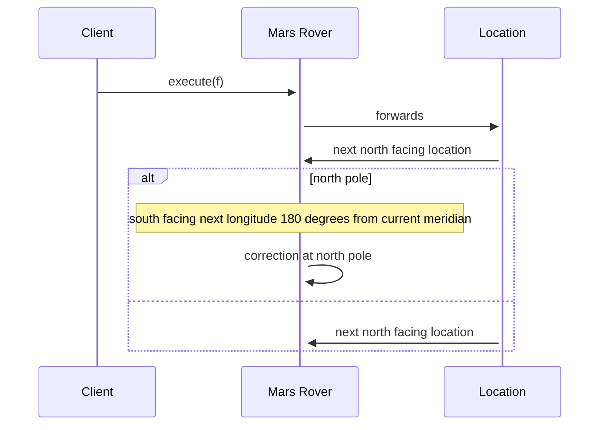
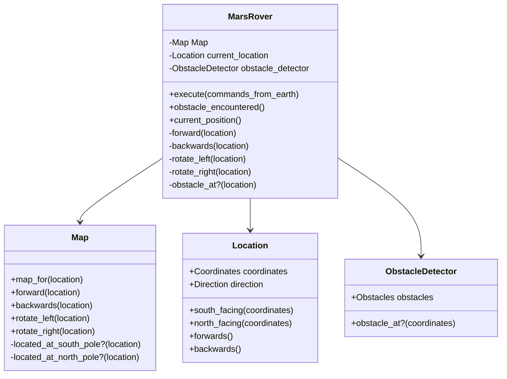

## Design Diagram
Authors: Emily Harris, Hemal Varambhia

```mermaid
sequenceDiagram
    Client->>+Mars Rover: execute(f)
    Mars Rover->>+Location: forwards
    Location->>+Mars Rover: next north facing location 
    alt north pole
        Note over Mars Rover: south facing next longitude 180 degrees from current meridian
        Mars Rover->> Mars Rover: correction at north pole
    else
       Location->>+Mars Rover: next north facing location 
    end
```

```mermaid
classDiagram
    MarsRover --> Map
    MarsRover --> Location
    MarsRover --> ObstacleDetector
    class MarsRover {
        -Map Map
        -Location current_location
        -ObstacleDetector obstacle_detector
        +execute(commands_from_earth)
        +obstacle_encountered()
        +current_position()
        -forward(location)
        -backwards(location)
        -rotate_left(location)
        -rotate_right(location)
        -obstacle_at?(location)

    }
    class Map {
        +map_for(location)
        +forward(location)
        +backwards(location)
        +rotate_left(location)
        +rotate_right(location)
        -located_at_south_pole?(location)
        -located_at_north_pole?(location)

    }

    class Location {
        +Coordinates coordinates
        +Direction direction
        +south_facing(coordinates)
        +north_facing(coordinates)
        +forwards()
        +backwards()
    }

    class ObstacleDetector {
        +Obstacles obstacles
        +obstacle_at?(coordinates)
    }
```